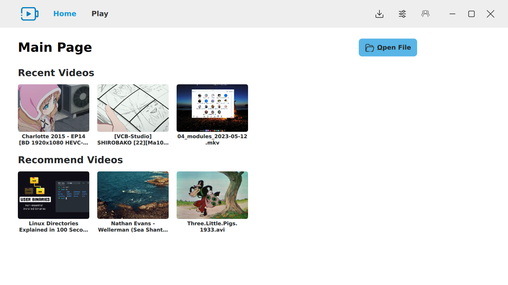

# QtMediaPlayer

 

    
    

    
    

 

## 初步界面设计
  ### 主界面
  
  主界面模型图 ：模仿Windows的Mediaplayer布局
  

      
  

  
  主界面原型图
  

      
  

  
   - Header View ：实现主界面、播放界面、设置和及介绍界面的切换
   - MainPage ：标题栏,右侧 "Open File" 可打开(*.mp4,*.avi,*.mkv)等视频文件
   - RecentVideos GridView ：点击视频预览图，将会索引视频所在位置所有视频，呈现在RecommendVideos GridView中
   - RecommendVideos GridView : 点击视频预览图，将会自动切换界面，播放视频
  
  ### 视频界面

  视频界面原型图
  

      
  

  
  
  ### 设置及其介绍界面

  
## 开发说明文档

## 用户说明文档

## 致谢
  - 参考源码 [Harnuna](https://invent.kde.org/multimedia/haruna)
  - Srt字幕解析库 [Simple, yet powerful C++ SRT Subtitle Parser Library](https://github.com/saurabhshri/simple-yet-powerful-srt-subtitle-parser-cpp)
  - 音量silder [balloon-slider](https://github.com/realmahdi/balloon-slider)
  - 图像处理 [FFmpeg](https://github.com/FFmpeg/FFmpeg)

  ### 参与者
  
  
  
## 介绍视频

  

